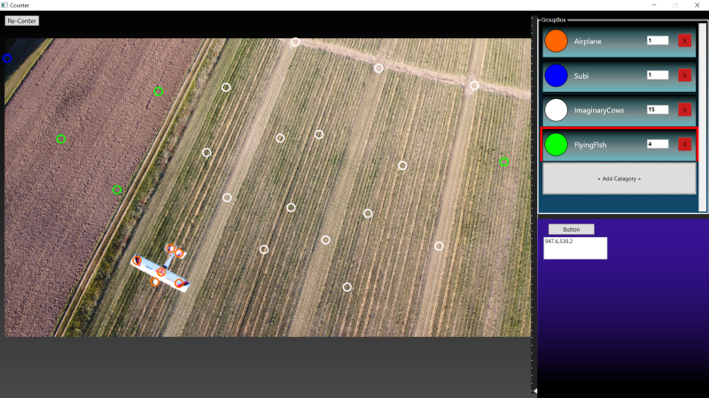

# WPF Counter Thingy

Attempting to create an application where one can view a photo and then zoom in and add points on it like a map. The points are counted and kept track of by color and catagory. 

# Ideas
* Save counts and other data in photo's .exif data - Maybe automatically in the background
* Option to read/disply prior photos via thier .exif data
* Photo Picker/Saver
* Text Comment Area
* Display .exif data regarding date/location/camera type/etc 
* Smaller thumbnail map with current view highlighted
* Zoom at location of pointer on scroll zoom

# Need to fix
* Don't allow multiple catagories of the same name else everything will break
* Weird issue if spaces in catagory name
* Scroll zoom doesn't work while cursor over placed dot

# Screenshot as of 8-7-22
